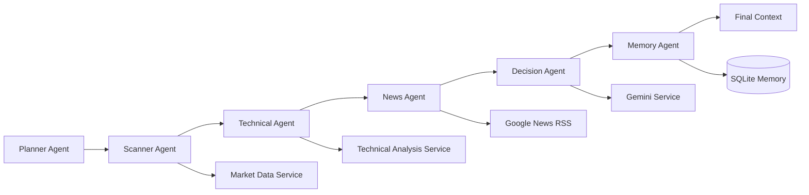
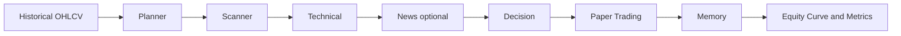
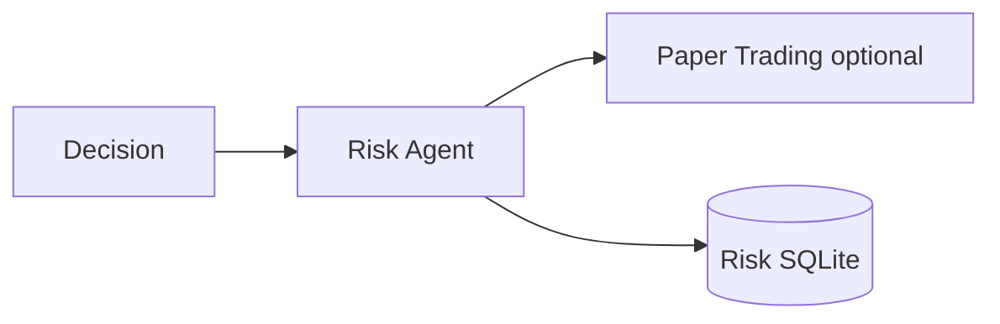

# HDX-08

HDX-08 is Version 1 of a modular AI trading-system architecture. It is deliberately an **analysis and research platform**, not a trading bot: it contains no broker integration, live market execution, or automatic order placement.

## Installation

```powershell
pip install -r requirements.txt
Copy-Item .env.example .env
python main.py
```

## Usage

Start the local API with `python main.py`, then retrieve a live, read-only Yahoo Finance quote:

Alternatively, use Uvicorn directly:

```powershell
uvicorn app.main:app --reload
```

```powershell
Invoke-RestMethod -Method Get -Uri http://127.0.0.1:8000/market/AAPL
```

Example response:

```json
{
  "symbol": "AAPL",
  "price": 212.15,
  "open": 210.34,
  "high": 214.2,
  "low": 209.9,
  "previous_close": 211.0,
  "volume": 54832112,
  "currency": "USD",
  "exchange": "NMS",
  "timestamp": "2026-01-01T00:00:00Z"
}
```

Quote and historical calls use yfinance, retry transient failures, enforce an eight-second provider timeout, and cache successful responses for 60 seconds. Provider failures return a structured error response rather than crashing the API.

Retrieve a technical summary calculated from six months of daily OHLCV data:

```powershell
Invoke-RestMethod -Method Get -Uri http://127.0.0.1:8000/analyze/AAPL
```

Example response:

```json
{
  "symbol": "AAPL",
  "price": 333.02,
  "analysis": {
    "trend": "Bullish",
    "rsi": 62.3,
    "macd": "Bullish",
    "volume": "Above Average",
    "strength": "Strong",
    "support": 324.4,
    "resistance": 337.8
  }
}
```

The technical engine calculates SMA (20/50/200), EMA (9/21/50), RSI-14, MACD, Bollinger Bands, ATR-14, VWAP, and 20-period volume average. This is informational analysis only; it does not place trades.

Run the analysis workflow:

```powershell
Invoke-RestMethod -Method Post -Uri http://127.0.0.1:8000/analyze -ContentType 'application/json' -Body '{"symbol":"AAPL"}'
```

The response contains planner, scanner, signal, trade-planning, risk, decision, and monitoring stages, plus a SQLite audit ID. The scanner uses the market-data service; the resulting decision is always non-executable.

Google ADK and Gemini are included behind an optional, non-executing research-agent boundary (`agents/gemini_research.py`). Add `GEMINI_API_KEY` to `.env` only when integrating a controlled research-summarization flow; the local mock workflow does not call external AI services.

## Structure

`app/services/market_data.py` provides the resilient Yahoo Finance adapter and its Pydantic data models.

`app/services/technical_analysis.py` provides the pandas/NumPy/`ta` technical-analysis engine.

## Multi-agent architecture

HDX-08 also exposes a dependency-injected multi-agent lifecycle. Each agent receives an `AgentContext`, returns an `AgentResult`, and may safely enrich the context without coupling to a global service.



Run it with:

```powershell
Invoke-RestMethod -Method Get -Uri http://127.0.0.1:8000/run/AAPL
```

The endpoint returns the request ID, completed agents, execution duration, market data, technical analysis, and AI explanation. The memory agent stores only request ID, symbol, timestamp, AI summary, confidence, and trend in local SQLite.

## News analysis

`NewsService` uses Google News RSS by default, with an injectable provider protocol for NewsAPI, Finnhub, Alpha Vantage, Polygon, or future sources. It collects up to 10 deduplicated, newest-first articles with title, source, published date, URL, and summary where supplied.

```powershell
Invoke-RestMethod http://127.0.0.1:8000/news/AAPL
Invoke-RestMethod http://127.0.0.1:8000/full-analysis/AAPL
```

The NewsAgent runs between Technical and Decision. Its Gemini summary is constrained to the supplied articles, and the DecisionAgent receives both technical and news analysis. All output remains informational; no broker or execution capability is included.

## Paper trading

The paper-trading engine is a local SQLite simulation only: it has no broker integration and never sends real orders. It begins with **₹100000** and enforces a maximum of five positions, a maximum 10% virtual allocation per trade, and a minimum confidence of 70.

```powershell
Invoke-RestMethod http://127.0.0.1:8000/portfolio
Invoke-RestMethod http://127.0.0.1:8000/trades
Invoke-RestMethod http://127.0.0.1:8000/trades/open
Invoke-RestMethod -Method Post http://127.0.0.1:8000/paper/reset
```

`PaperTradingAgent` is disabled by default and acts only on an explicit `paper_action` placed in agent context. It supports virtual `OPEN`, `CLOSED`, `STOP LOSS`, and `TAKE PROFIT` lifecycle states. Completed virtual trade details are recorded by the MemoryAgent alongside analysis memory.

## Backtesting

Backtesting replays daily yfinance OHLCV data through the existing Planner, Scanner, Technical, optional News, Decision, Paper Trading, and Memory agents. It uses an isolated paper-trading SQLite database, so it cannot change the live virtual portfolio or the live analysis workflow.



```powershell
$body = @{ symbol = "AAPL"; start_date = "2020-01-01"; end_date = "2025-01-01"; initial_capital = 100000; strategy_name = "ema_trend_v1" } | ConvertTo-Json
Invoke-RestMethod -Method Post -Uri http://127.0.0.1:8000/backtest/run -ContentType "application/json" -Body $body
Invoke-RestMethod http://127.0.0.1:8000/backtests
```

Results include trade history, daily equity curve, ROI, drawdown, win/loss statistics, profit factor, and holding time. The initial `ema_trend_v1` strategy creates virtual actions from existing technical output only; it never connects to a broker or executes live orders.

## Portfolio intelligence and risk management

RiskAgent runs after DecisionAgent and before the optional PaperTradingAgent. It only approves or rejects an explicit virtual action; it does not generate trading signals or execute an order. Risk configuration is injected through `RiskConfig`, including position count, stock/sector allocation, daily exposure, drawdown, cash reserve, confidence, and per-trade limits.



```powershell
Invoke-RestMethod http://127.0.0.1:8000/portfolio/risk
Invoke-RestMethod http://127.0.0.1:8000/portfolio/stats
Invoke-RestMethod http://127.0.0.1:8000/portfolio/exposure
Invoke-RestMethod http://127.0.0.1:8000/portfolio/sectors
```

The risk service persists daily portfolio snapshots, risk reports, exposure history, and portfolio metrics. Sector classification and correlation checks use replaceable interfaces so other exchanges, markets, and future correlation providers can be introduced without changing RiskAgent.

### Adding an agent

Create a class in `app/agents/` with a unique `name`, `enabled_by_default = True`, and `run(context) -> AgentResult`. Inject its dependencies through the constructor and add its instance to `build_orchestrator`. The Planner reads the registered enabled agent list, so compatible future agents (for example News, Risk, Macro, or Social Sentiment) participate without changes to the orchestrator itself.

## Gemini market explanation

Add your Google Gemini API key to `.env`:

```text
GOOGLE_API_KEY=your_key_here
```

The service uses `google-genai` to explain only the supplied market and technical JSON. It enforces structured JSON output, validates it with Pydantic, retries transient failures, and returns a safe error object if credentials or Gemini are unavailable. It never creates orders or trade instructions.

```powershell
Invoke-RestMethod -Method Get -Uri http://127.0.0.1:8000/ai-analysis/AAPL
```

The response contains `market_data`, `technical_analysis`, and `ai_analysis`. AI analysis is informational only and must use `Insufficient Data` where the supplied data cannot support a conclusion.

- `agents/` — seven single-responsibility workflow agents.
- `tools/` — protocol interfaces and safe local mock adapters.
- `api/` — FastAPI delivery layer and Pydantic contracts.
- `database/` — SQLite audit persistence.
- `memory/` — workflow-scoped state.
- `docs/` — architecture, installation, roadmap, and developer guide.

## Design

The application uses constructor injection to keep business workflow logic independent of external adapters. See [architecture documentation](docs/architecture.md), [installation guide](docs/installation.md), [developer guide](docs/developer-guide.md), and [roadmap](docs/roadmap.md).

## Safety boundary

HDX-08 does not place, route, simulate, or automatically execute orders. Any future capability expansion should undergo dedicated technical, security, compliance, and human-review design.
