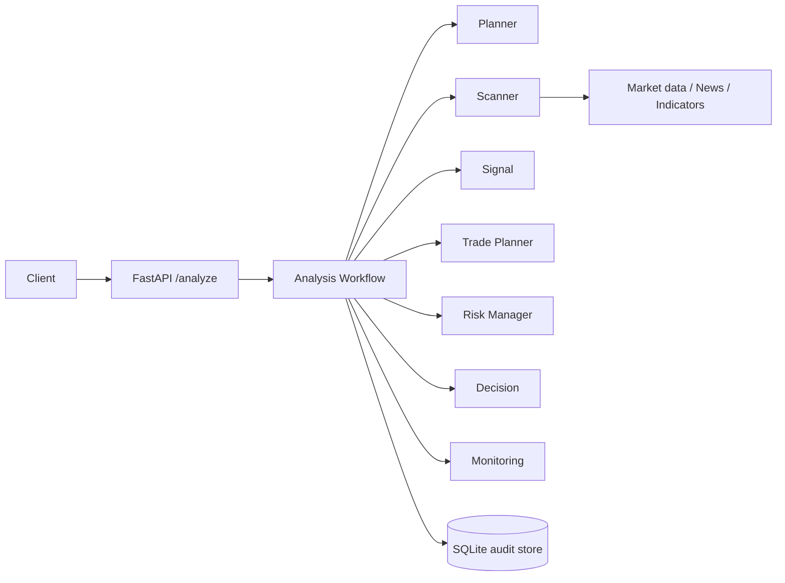

# Architecture

HDX-08 follows Clean Architecture: the API is a delivery adapter, agents hold application orchestration, tool protocols define infrastructure boundaries, and SQLite is an outbound persistence adapter. Dependencies point inward through Python protocols and constructor injection.

No component has broker credentials, order-routing code, or live-execution capability.
